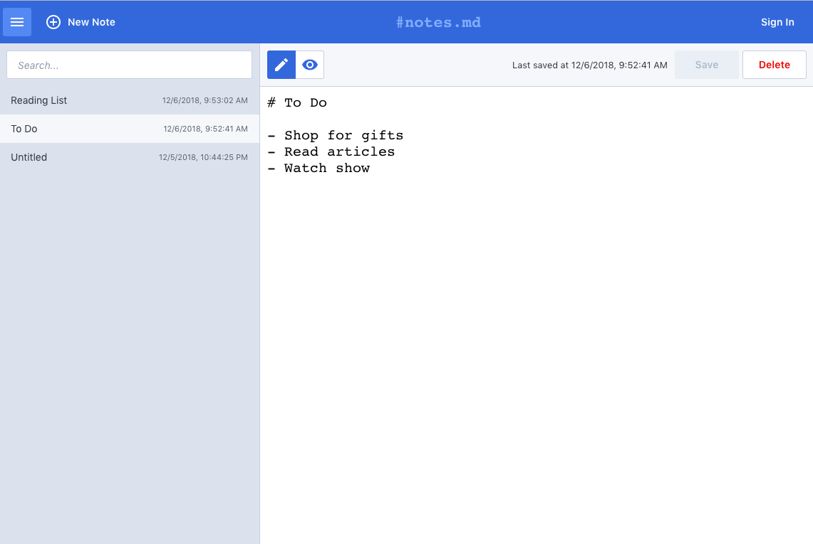

# notes.md

A web app for taking notes (with GitHub Markdown support). Enjoy!



## Installation

```
npm install
npm start
open http://localhost:3000 # if doesn't open on its own
```

## Frameworks

- [Create React App](https://facebook.github.io/create-react-app/)
- [React](https://reactjs.org/)
- [Emotion](https://emotion.sh/)
- [Mineral UI](https://mineral-ui.com/)
- [React Markdown](https://rexxars.github.io/react-markdown/)
- [LocalStorage](https://developer.mozilla.org/en-US/docs/Web/API/Storage/LocalStorage)

## Future

- Support persistence to a backend
